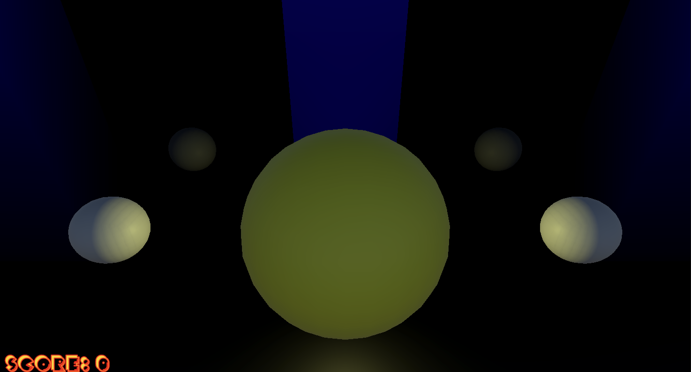
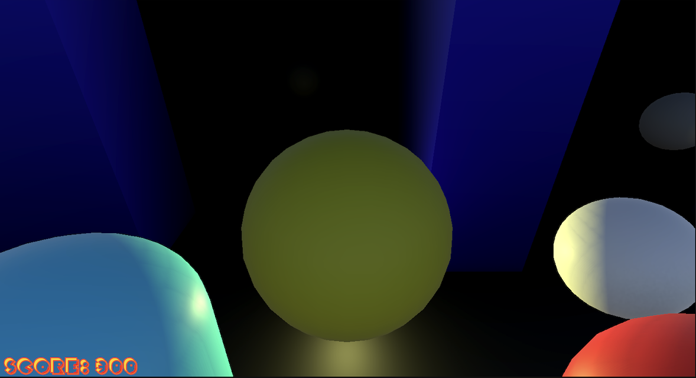

# 3D Pac-Man (Unity)

A 3D Pac-Man inspired project built in Unity, with a main menu, collectible pellets, power-pellet frightened state, NavMesh ghost chasing, and arcade-style sound effects.

## Demo

## Game Objective

Collect all pellets in the maze to win the round while avoiding ghosts.

- Pellet: `+50` points
- Power Pellet: `+100` points
- Eat frightened ghost: `+200` points

When all pellets are collected, the game returns to the main menu.
If a ghost catches you while not frightened, the player dies and the game returns to the main menu after a short delay.

## Controls

### Main Menu

- Click **Play** to start the game scene
- Click **Quit** to close the application

### In-Game Movement

- `W A S D` or Arrow Keys to move
- Movement is camera-relative (forward/right are taken from the active camera)

Cursor behavior in game:

- Cursor is locked and hidden during gameplay
- Cursor is unlocked and visible on player death

## Core Gameplay Features

- Score system with live UI updates (`Score: X`)
- Pellet counting and win condition through `PelletManager` + `GameManager`
- Power-pellet frightened mode for ghosts
- Ghost respawn flow after being eaten
- Scene flow: `MainMenu` -> `Game` -> `MainMenu`

## Animation Features (Floating Collectibles)

Collectibles use an Animator Controller for a floating loop effect:

- Controller: `Floating/FloatingController.controller`
- Clips:
  - `Floating/FloatingUp.anim`
  - `Floating/FloatingDown.anim`

Animation behavior:

- `FloatingUp`: local Y from `0` to `0.5` over `1s`
- `FloatingDown`: local Y from `0.5` to `0` over `1s`
- Both clips loop, creating continuous bobbing for pellet visuals

Prefab usage:

- `Pellet.prefab` and `PowerPellet.prefab` include a `FloatingVisual` child with `Animator`

## Environment and Rendering Settings

The project uses **URP** (`com.unity.render-pipelines.universal`).

### Scene Environment

`Game` scene (`Scenes/Game.unity`):

- Fog enabled (`m_Fog: 1`)
- Fog color: black (`0,0,0`)
- Exponential fog mode (`m_FogMode: 3`)
- Fog density: `0.3`

`MainMenu` scene (`Scenes/MainMenu.unity`):

- Fog disabled (`m_Fog: 0`)
- Stored fog density value: `0.01` (inactive unless fog is enabled)

### Lighting Notes

- Baked lighting is enabled in project lighting settings
- Typical bake parameters include:
  - Bake resolution: `40`
  - Lightmap max size: `1024`

## Ghost Navigation (NavMesh)

Ghost movement uses `NavMeshAgent` and runtime destination updates:

- Ghosts chase the player normally
- On power pellet event, ghosts enter frightened mode for `4s`
- Frightened behavior:
  - Speed reduced to one-third of normal
  - Material switched to frightened material
  - Target changes to flee direction away from player
- After frightened mode ends:
  - Speed/material/audio return to normal

NavMesh setup details:

- Navigation package: `com.unity.ai.navigation`
- Scene has `NavMeshSurface` for baking walkable space
- `Pellet` and `PowerPellet` prefabs include `NavMeshModifier` with `Ignore From Build` enabled
  - This prevents collectibles from affecting baked navigation

## Audio

### Music

- `MusicManager` is persistent (`DontDestroyOnLoad`)
- Main menu music is played in `MainMenu`
- Music stops when entering the game scene

### SFX (Gameplay)

Player audio clips:

- `pacman_chomp.wav` (looped while moving)
- `pacman_death.wav`
- `pacman_eatghost.wav`

Ghost audio clips:

- `ghost_movement.flac` (normal movement)
- `frightened_ghost_movement.flac` (during frightened mode)

Additional audio asset:

- `pacman_beginning.wav` (available in project audio folder)

## Project Structure (Relevant)

### Scripts

- `Player.cs`
- `Ghost.cs`
- `GameManager.cs`
- `Pellet.cs`
- `PowerPellet.cs`
- `PelletManager.cs`
- `UIManager.cs`
- `MusicManager.cs`

### Prefabs

- `Ghost.prefab`
- `Pellet.prefab`
- `PowerPellet.prefab`

### Floating Animation

- `FloatingController.controller`

## How to Run

1. Open the project in Unity.
2. Verify build scenes order:
   1. `Scenes/MainMenu.unity`
   2. `Scenes/Game.unity`
3. Press Play from the `MainMenu` scene.
